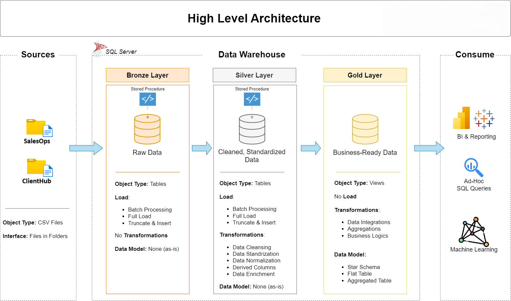

# 📊 Data Warehouse & Analytics Project

Welcome to the **SQL-DWH-Project** repository! 🚀  
This project showcases a complete data warehousing and analytics solution, built from scratch. It is designed as a **portfolio project** to demonstrate core competencies in **data engineering**, **ETL development**, and **data analytics** following modern industry standards.

---

## 🏗️ Data Architecture – Medallion Framework

The solution uses the **Medallion Architecture** (Bronze, Silver, Gold) to organize data layers and processing stages:


- **Bronze Layer**: Raw data ingested as-is from source CSV files into a SQL Server database.
- **Silver Layer**: Cleansed, standardized, and normalized data ready for modeling.
- **Gold Layer**: Business-ready star schema optimized for analytics and reporting.

---

## 📌 Project Highlights

This project includes:

- **Data Architecture**: Designing a scalable modern warehouse using the Medallion approach.
- **ETL Pipelines**: Developing SQL-based pipelines to ingest, transform, and load data.
- **Data Modeling**: Creating fact and dimension tables to support analytical queries.
- **Reporting & Insights**: Generating reports and dashboards using SQL for actionable insights.

---

## 🧠 Skills Demonstrated

Ideal for professionals and students aiming to highlight skills in:

- SQL Development  
- Data Warehousing  
- ETL Pipelines  
- Data Modeling (Star Schema)  
- Data Engineering & Integration  
- Business Intelligence & Analytics  

---

## 🧰 Tools & Resources

All tools and resources used in this project are **free and accessible**:

- **Datasets**: Provided as CSV files (SalesOps & ClientHub).
- **SQL Server Express**: Lightweight database engine.
- **SQL Server Management Studio (SSMS)**: GUI to manage and query SQL Server.
- **Draw.io**: For data flow and architecture diagrams.
- **Notion**: Used for project planning and documentation.

---

## 🚧 Project Requirements

### 🏗️ Data Engineering

**Goal**: Build a centralized data warehouse in SQL Server for consolidated sales data analysis.

- **Source Systems**: SalesOps and ClientHub data (CSV files).
- **Data Quality**: Clean and resolve inconsistencies.
- **Integration**: Merge datasets into a unified star schema.
- **Focus**: Use the latest data snapshot.
- **Deliverables**: Clear documentation for both technical and business audiences.

### 📈 Data Analysis & Reporting

**Goal**: Generate insights using SQL queries on the gold layer.

- Analyze:
  - Customer behavior
  - Product performance
  - Sales trends
- Deliver business metrics to support decision-making.


---

## 📁 Repository Structure

```plaintext
SQL-DWH-Project/
│
├── datasets/                  # SalesOps and ClientHub source data (CSV)
├── docs/                      # Project documentation & diagrams
│   ├── etl.png                # ETL pipeline flow
│   ├── data_architecture.png
│   ├── data_catalog.md        # Dataset descriptions & metadata
│   ├── data_flow.png          # Data pipeline flow diagram
│   ├── data_models.png        # Star schema and table models
│   ├── naming-conventions.md  # Naming guidelines
│
├── scripts/                   # SQL scripts for data processing
│   ├── bronze/                # Ingest raw data
│   ├── silver/                # Transform & clean data
│   ├── gold/                  # Create analytical models
│
├── tests/                     # Data validation & quality checks
├── README.md                  # Project overview (this file)
├── LICENSE                    # Project license
├── .gitignore                 # Git ignore rules
```

---

## ✅ Getting Started

1. Clone the repository  
2. Restore or create your SQL Server database  
3. Load datasets into the bronze layer  
4. Run ETL scripts from bronze → silver → gold  
5. Query the gold layer for insights or build reports

---

## 📝 License

This project is licensed under the [MIT License](./LICENSE).

---

## 👨‍💻 About Me

Hi, I'm an aspiring Data Professional passionate about transforming raw data into actionable insights.  
This project is a showcase of my skills in:

- Building ETL pipelines
- Designing analytical data models
- Writing optimized SQL for analytics
- Creating clear documentation and visualizations

Feel free to connect with me on [LinkedIn](https://www.linkedin.com/in/aboubekrine-sedigh/) 

